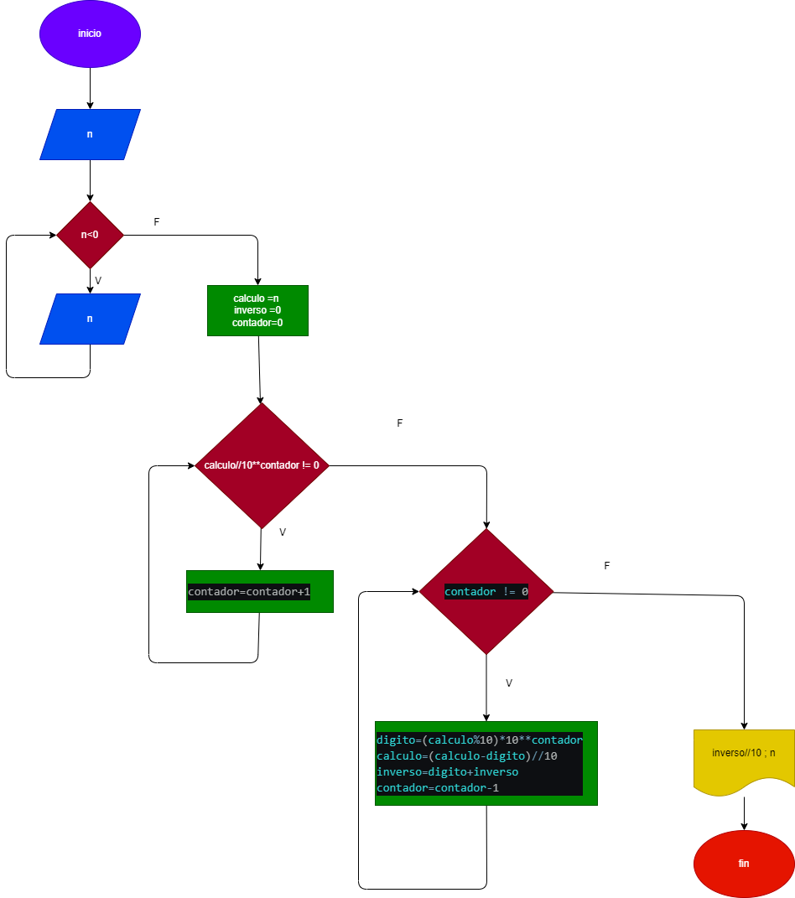

# 6-de-octubre-ejercicio-2
# hacer el diagrama de flujo y codigo , que ingrese un numero positivo de cualquier numero de digitos; que calcule su numero inverso y lo imprima junto al numero 
# Diagrama de flujo:
